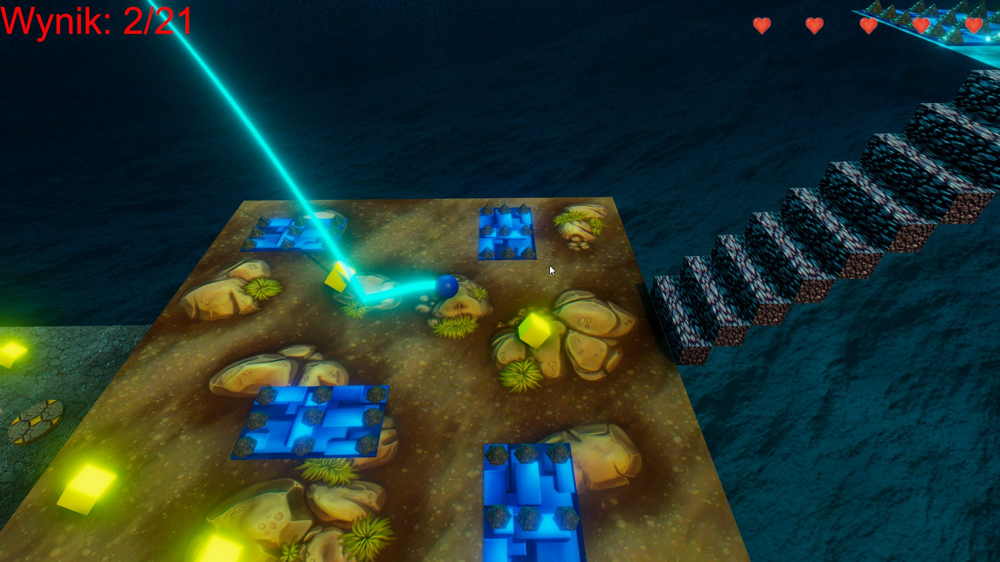

# Roll-a-ball

## Table of contens
* [General info](#general-info)
* [Technologies](#technologies)
* [Some screenshoot](#some-screenshoot)

## General info
This is first Unity project which helped to start learning Unity by doing. Game is for PC. It's popular first project roll-a-ball. Player controll a ball and try collect
all items. There are a lot of trap and lava place where player can die or labyryth. Player has only 5 lives. This project learn me a lot of things. 

## Technologies
Project is created with:
* Unity 2020.3.30f1
* assets from UnityAssets

## Some screenshoot
* Menu start

* Change volume with using Singleton

* Frst scene

* Second scene

* Second scene with lava and particle system

* Second scene with needle trap

